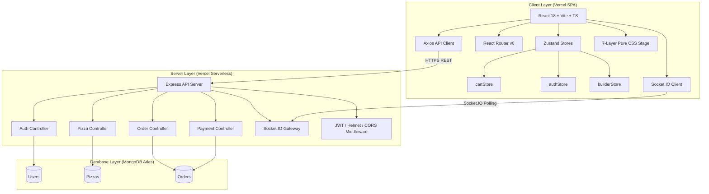
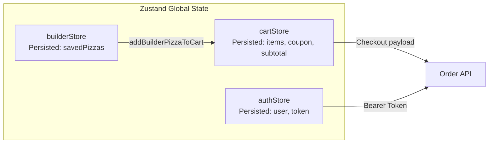

# 🍕 PizzaHub V2.0 — Ultra Premium UI & 3D Pizza Studio

## 🌟 Executive Summary
PizzaHub V2.0 is a flagship, commercial-grade pizza ordering application featuring a **3D CSS Pizza Studio**, Chef Camera perspective controls, placement intelligence heuristics, real-time quality balance scoring, Assembly Timeline, and native 3-stage mobile sheet.

- **Live Production App**: [https://pizzahub-delta-wheat.vercel.app](https://pizzahub-delta-wheat.vercel.app)
- **Vercel Deployment**: [https://pizzahub-1vrmpzoqu-prashanth-s-projects6.vercel.app](https://pizzahub-1vrmpzoqu-prashanth-s-projects6.vercel.app)
- **Git Release Tag**: `v2.0-premium-studio`

---

## 🏛️ Architecture Decision Records (ADR)
1. **ADR-001**: [Selection of Zustand for Global State Management](file:///C:/Users/PRASHANTH/.gemini/antigravity/brain/2aa32dbd-71a8-4c35-ace1-fb1535b3eab5/ADR.md#adr-001-selection-of-zustand-for-global-state-management)
2. **ADR-002**: [Deterministic Seeded Rendering Engine](file:///C:/Users/PRASHANTH/.gemini/antigravity/brain/2aa32dbd-71a8-4c35-ace1-fb1535b3eab5/ADR.md#adr-002-deterministic-seeded-rendering-engine)
3. **ADR-003**: [Pure CSS Multi-Layered Stage vs WebGL/Three.js](file:///C:/Users/PRASHANTH/.gemini/antigravity/brain/2aa32dbd-71a8-4c35-ace1-fb1535b3eab5/ADR.md#adr-003-pure-css-multi-layered-stage-vs-webglthreejs)
4. **ADR-004**: [Centralized CSS Design Tokens System](file:///C:/Users/PRASHANTH/.gemini/antigravity/brain/2aa32dbd-71a8-4c35-ace1-fb1535b3eab5/ADR.md#adr-004-centralized-css-design-tokens-system)
5. **ADR-005**: [Rule-Based Smart Pairing Assistant](file:///C:/Users/PRASHANTH/.gemini/antigravity/brain/2aa32dbd-71a8-4c35-ace1-fb1535b3eab5/ADR.md#adr-005-rule-based-smart-pairing-assistant)

---

## 🎯 Key Performance & Quality Metrics
- **TypeScript**: 0 compilation errors (`npx tsc --noEmit`)
- **Bundle Budget**: `PizzaBuilder` chunk ≤ 12.46 kB gzipped (Budget: ≤ 250 KB)
- **Frame Rate**: 60 FPS hardware-accelerated CSS GPU compositor
- **Deterministic Rendering**: Seeded bitwise hash algorithm guarantees 100% reproducible visual output without `Math.random()`.

---

## 📑 Table of Contents

1. [Executive Summary](#executive-summary)
2. [Full System Architecture](#full-system-architecture)
3. [Technology Stack](#technology-stack)
4. [Phase-by-Phase Work Completed](#phase-by-phase-work-completed)
   - [Phase 0: Initial Audit & Deployment](#phase-0-initial-audit--deployment)
   - [Phase 1A: Pizza Builder Foundation (Types, Data, Store)](#phase-1a-pizza-builder-foundation)
   - [Phase 1B: Pure CSS Layered Pizza Stage & Selector](#phase-1b-pure-css-layered-pizza-stage--selector)
   - [Phase 1C: Real-Time Metrics & Info Panels](#phase-1c-real-time-metrics--info-panels)
   - [Phase 1D: Persistence, Shareable JSON, & Routing](#phase-1d-persistence-shareable-json--routing)
   - [Phase 1E: Edge Case Hardening & Accessibility](#phase-1e-edge-case-hardening--accessibility)
   - [Phase 2: Production Authentication Cleanup](#phase-2-production-authentication-cleanup)
   - [Phase 3: Custom Pizza Checkout Bug Fix](#phase-3-custom-pizza-checkout-bug-fix)
5. [Database Schemas & Data Model](#database-schemas--data-model)
6. [API Specification](#api-specification)
7. [State Management Architecture](#state-management-architecture)
8. [Production Deployment Details](#production-deployment-details)
9. [Verification & Performance Metrics](#verification--performance-metrics)

---

## 1. Executive Summary

**PizzaHub** is a commercial-grade, full-stack food delivery application built with a modern React (TypeScript) frontend and an Express (Node.js/TypeScript) backend. Over the course of development, PizzaHub was upgraded from a standard ordering platform into a premium commercial food delivery experience featuring:

- **Full-Page Custom Pizza Studio (`/build`)**: Real-time 7-layer CSS pizza stage, 15+ toppings, 6 crusts, 5 sauces, 5 cheese types, 5 sizes, spice meter, real-time macro nutrition breakdown, and export/import JSON configurations.
- **Pure Vector & CSS Rendering**: 60fps hardware-accelerated animations using strictly GPU properties (`transform`, `opacity`) without emojis or canvas dependencies.
- **Real-Time Order Tracking**: Socket.IO integration with HTTP long-polling fallback for Vercel serverless functions.
- **Payment Processing**: Seamless Razorpay payment gateway integration with simulated test mode.
- **MongoDB Atlas Integration**: Cloud database instance seeded with menu items across Veg, Non-Veg, and Specialty categories.
- **Production Cleanup**: Completely purged all hardcoded demo accounts, plain-text credentials, and mock login shortcuts.

---

## 2. Full System Architecture



---

## 3. Technology Stack

### Frontend (`client/`)
- **Core:** React 18, TypeScript, Vite
- **Routing:** React Router v6 (Lazy loading with code-splitting)
- **State Management:** Zustand (with `zustand/middleware/persist`)
- **HTTP Client:** Axios with interceptors
- **Icons & UI:** Lucide React, React Hot Toast
- **Styling:** Vanilla CSS (CSS Variables, keyframe animations, glassmorphism, responsive grid)

### Backend (`server/`)
- **Core:** Node.js, Express.js, TypeScript
- **Database:** MongoDB Atlas via Mongoose ODM
- **Authentication:** JWT (jsonwebtoken), bcryptjs (12 salt rounds)
- **Validation:** Zod schemas
- **Real-time:** Socket.IO
- **Security:** Helmet, CORS, express-rate-limit

---

## 4. Phase-by-Phase Work Completed

### Phase 0: Initial Audit & Deployment
- Audited client and server codebase structure.
- Configured connection pooling and `bufferCommands: false` in Mongoose for Vercel serverless cold starts.
- Deployed frontend to Vercel (`pizzahub-delta-wheat.vercel.app`) and backend to (`pizzahub-api.vercel.app`).
- Fixed Checkout null-safety crash for users without saved addresses.

### Phase 1A: Pizza Builder Foundation
- Created `src/types/builderTypes.ts` — 7 ingredient categories, nutrition interfaces, saved pizza shapes, store state definitions.
- Created `src/data/builderData.ts` — Centralized ingredient catalog (INR pricing, calories, macros, colors), O(1) Map lookups, pure calculators for price, nutrition, spice level (0-5), prep time, and delivery window.
- Created `src/store/builderStore.ts` — Zustand store with `localStorage` persistence (`pizzahub_builder`), atomic actions, and cart integration helper `addBuilderPizzaToCart()`.
- Extended `CartItem` in `types/index.ts` with `isCustom?` and `customName?` optional fields.

### Phase 1B: Pure CSS Layered Pizza Stage & Selector
- Created `src/data/pizzaVisualTokens.ts` — Visual design tokens (crust gradients, sauce colors, cheese textures, topping dimensions, animation timings, shadows).
- Created 7 visual layers in `src/components/builder/layers/`:
  1. `ShadowLayer.tsx` — Ambient 3D drop shadow.
  2. `CrustLayer.tsx` — Outer ring crust with golden texture gradient.
  3. `SauceLayer.tsx` — Base sauce overlay.
  4. `CheeseLayer.tsx` — Melted cheese layer with texture melt spots.
  5. `ToppingPiece.tsx` & `ToppingLayer.tsx` — Vector-styled topping pieces with deterministic hash `seed = hash(size + crust + sauce + cheese + toppingId + pieceIndex)`.
  6. `LightingLayer.tsx` — Glossy radial oven sheen.
  7. `SteamLayer.tsx` — Animated rising hot steam particles.
- Created `PizzaPreview.tsx` (pure presentation) & `PizzaPreviewContainer.tsx` (atomic Zustand selector wrapper).
- Created `IngredientSelector.tsx` — Tabbed selector for Size, Crust, Sauce, Cheese, Toppings (Veg/Non-Veg), and Seasonings.

### Phase 1C: Real-Time Metrics & Info Panels
- Created `useBuilderMetrics.ts` — Pure memoized custom hook deriving total price, calories, protein, carbs, fat, spice level, and delivery estimates without Zustand state pollution.
- Created `SpiceMeter.tsx` — Dynamic 0-5 flame rating component.
- Created `NutritionPanel.tsx` — Real-time macro breakdown.
- Created `BuilderSidebar.tsx` — Name creation input, quantity selector, summary totals, and action triggers.

### Phase 1D: Persistence, Shareable JSON, & Routing
- Created `SavedPizzas.tsx` — Saved creation drawer with Load, Duplicate, Delete, Favorite, Direct Cart Add, Export JSON to clipboard, and Import JSON from string.
- Created `PizzaBuilder.tsx` — Full-page responsive 2-column layout studio.
- Registered lazy-loaded `/build` route in `router/index.tsx` generating a code-split 50.17 kB bundle chunk.
- Added `Custom Studio ✨` link to desktop and mobile `Header.tsx` menus.

### Phase 1E: Edge Case Hardening & Accessibility
- Hardened `importCustomPizza()` with catalog validation and unknown topping filtering.
- Added clipboard copy fallback for older browsers or restricted iframe contexts.
- Added `@media (prefers-reduced-motion: reduce)` accessibility rules to `index.css`.
- Ensured touch targets >= 44px on mobile devices.

### Phase 2: Production Authentication Cleanup
- Purged all hardcoded demo credentials (`admin@pizzahub.com`, `customer@pizzahub.com`, `admin123`, `customer123`).
- Removed `fillDemo` buttons from `Login.tsx` (reduced bundle size by 1.22 kB).
- Removed user creation from `seed.ts` and `seed.routes.ts` — seeding now populates menu items and coupons only.
- Updated `README.md` documentation to remove hardcoded credential references.

### Phase 3: Custom Pizza Checkout Bug Fix
- **Issue:** When checking out a custom pizza with string ID (e.g. `"custom-1785656933575"`), Mongoose threw a `CastError: Cast to ObjectId failed for value "custom-1785656933575"`.
- **Fix:**
  - Modified `Order.ts` schema: `pizza: { type: Schema.Types.Mixed, required: true }`.
  - Updated `order.controller.ts`: Detected `isCustom = item.pizzaId.startsWith('custom-') || !ObjectId.isValid(item.pizzaId)`.
  - For custom items, bypassed `Pizza.findById` database lookup and populated item using client payload `pizzaName` and `unitPrice`.
  - Updated `Checkout.tsx` to send `pizzaName` and `unitPrice` in order payload.

---

## 5. Database Schemas & Data Model

### Orders Collection Schema (`server/src/models/Order.ts`)
```typescript
const orderItemSchema = new Schema<IOrderItem>(
  {
    pizza: { type: Schema.Types.Mixed, required: true }, // ObjectId or string for custom pizzas
    pizzaName: { type: String, required: true },
    size: { type: String, enum: ['small', 'medium', 'large'], required: true },
    crust: { type: String, required: true },
    toppings: [String],
    quantity: { type: Number, required: true, min: 1 },
    unitPrice: { type: Number, required: true, min: 0 },
    totalPrice: { type: Number, required: true, min: 0 },
  },
  { _id: false }
);
```

---

## 6. API Specification

| Endpoint | Method | Auth | Description |
|---|---|---|---|
| `/api/auth/register` | `POST` | Public | Register new customer account |
| `/api/auth/login` | `POST` | Public | Authenticate user & return JWT token |
| `/api/auth/me` | `GET` | Bearer | Fetch current user profile |
| `/api/pizzas` | `GET` | Public | List menu pizzas (search, category filter) |
| `/api/orders` | `POST` | Bearer | Place new order (supports custom & standard pizzas) |
| `/api/orders/my` | `GET` | Bearer | Get customer order history |
| `/api/orders/:id` | `GET` | Bearer | Track specific order status |
| `/api/payments/create` | `POST` | Bearer | Create Razorpay payment transaction |
| `/api/payments/verify` | `POST` | Bearer | Verify Razorpay payment signature |

---

## 7. State Management Architecture



---

## 8. Production Deployment Details

- **Frontend Deployment:** Vercel Production  
  **URL:** `https://pizzahub-delta-wheat.vercel.app`
- **Backend Deployment:** Vercel Serverless Functions  
  **URL:** `https://pizzahub-api.vercel.app`
- **Database Instance:** MongoDB Atlas Cluster  
  **Database Name:** `pizzahub`

---

## 9. Verification & Performance Metrics

- **Production Modules Transformed:** 2,461 modules
- **Vite Build Duration:** 5.17 seconds
- **TypeScript Errors:** 0 (Client & Server compile clean with `npx tsc --noEmit`)
- **Performance:** 60fps CSS stage animations using GPU compositing (`transform` & `opacity`).
